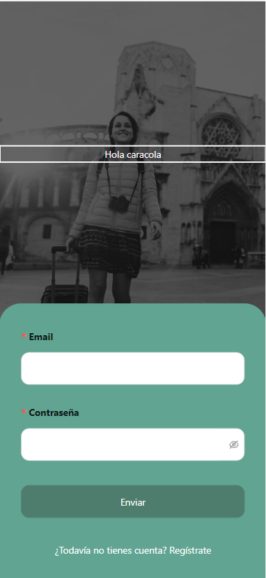
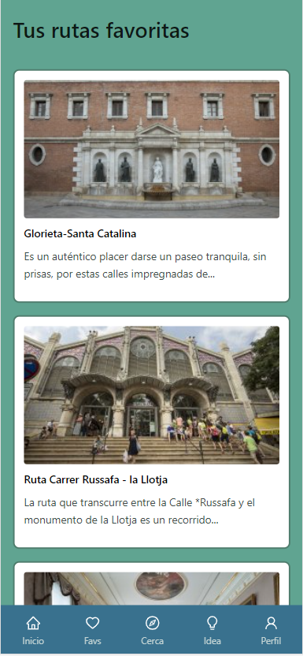

#  <center>Valencia Spot (Routes App with React Redux)</center> 

 ## :Marcador: índice

 - [Sobre el proyecto](#)

 - [Requisitos](#)

    - [Instalación y despliegue](#)

    - [Tecnologías utilizadas](#)

    - [Origen](#)

    - [Organización](#)

- [Retos presentados](#)

- [En el tintero](#)

- [Agradecimientos](#)

- [Autores](#)


## Sobre el proyecto

This project unifies everything learned so far. We will develop a routes app (mobile first) where users will register, login, view routes and can save routes to their favourites. All this Using the API we will recieve from the good people on the data science course. 

## Requisitos
Una vez analizadas las necesidades del proyecto, se espera
que los estudiantes desarrollen un frontend & backend que sea capaz de lo siguiente:
● Registro de usuarios.
● Inicio de sesión de usuario.
● Puedes ver las rutas, comentar y calificar las diferentes rutas.
● Puede guardar rutas en favoritos.
● Cuestionario para la recogida de datos.
● Página de perfil donde los usuarios pueden editar su perfil.
● Uso de ramas con git, cuando el proyecto está terminado debe haber dos ramas, la maestra o principal y la de desarrollo.
● Excelente presentación READAME.

## Instalación y despliegue

BackEnd

    1. Descarga el repositorio desde (https://github.com/xavi-mat/routes-back) usando `git clone https://github.com/xavi-mat/routes-back` Desde el terminal en la carpeta que quieras.  

    2. Una vez clonado el repositorio, se deben instalar todos los paquetes necesarios para el proyecto con `npm i` 
    

    3. Dentro de la carpeta clonada de (https://github.com/xavi-mat/routes-back) tienes que ejecutar el comando `npm start`

- FrontEnd

    1. Descargue el repositorio desde (https://github.com/alextebbitt/routes-front-) usando `git clone https://github.com/alextebbitt/routes-front-` Desde el terminal en la carpeta que quieras.

    2. Una vez clonado el repositorio, hay que instalar todos los paquetes que necesita el proyecto con `npm i`

    3. Dentro de la carpeta clonada de (https://github.com/alextebbitt/routes-front-) tienes que ejecutar el comando `npm start`

## Tecnologías utilizadas

```JavaScript
const project = {
    frontEnd:{
        main:["JavaScript","React","sass"],
        modules:[
            "react-router-dom",
            "antd",
            "@ant-design/icons",
            "axios",
            "normalize.css"
        ]
    },
    backEnd:{
        main:["JavaScript","MongoDB","NodeJS","Express","Mongoose"],
        modules:[
            "Bcrypt",
            "Jsonwebtoken",
            "Multer",
            "Postman"
        ]
    }
} 
```
 ## Origen


El proyecto se origina en el bootcamp FullStack en [TheBridge](https://www.thebridge.tech/). Es el proyecto final del Bootcamp que simula un proyecto de la vida real en el que eres parte de un equipo que trabaja en un proyecto. Necesitamos crear tanto el frontend como el backend, logrando así un proyecto Full-Stack. El objetivo principal es crear una aplicación de rutas funcional, utilizando React Redux en el frontend y MongoDB y Mongoose en el backend.


### pagina de login 


### pagina de Register 


### User favoritos


### Vista Routes 


## Organización

To organize the tasks we have used the application [Trello](https://trello.com/) with which you can comfortably manage tasks and "Tickets"

### Captura del Trello


## Retos presentados

Este fue un proyecto increíblemente difícil, dado que no conocíamos React hace unas semanas. Ha sido una curva de aprendizaje empinada. En poco más de una semana hemos creado una primera aplicación móvil backend y frontend. Ha habido muchos desafíos en el camino, pero todavía estoy motivado para seguir aprendiendo y mejorando. 


## En el tintero

- Back: Testing (jest) 

- Front: Testing (cypres?) (extra)

- 

## Agradecimientos

Queremos agradecer a nuestro mentor [Germán](https://github.com/GeerDev) por enseñarnos React hace tan solo unas semanas y por su paciencia con nosotros. También queremos agradecer a todos nuestros compañeros del Bootcamp por estar siempre ahí para ayudarnos a resolver problemas o simplemente para darnos alguna crítica constructiva.


## Autores

### [Xavier Matoses](https://github.com/xavi-mat)
### [Fran Pérez Durán](https://github.com/franpd8)
### [Alex Tebbitt](https://github.com/alextebbitt)